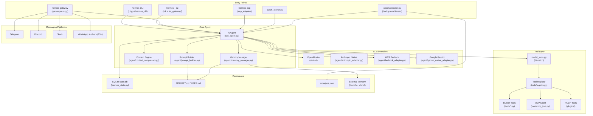

# 01 — Architecture Map: hermes-agent

## High-Level Architecture



---

## Runtime Components

| Component | Process | Language | Key File |
|-----------|---------|----------|----------|
| Agent runner | Main Python process | Python | `run_agent.py` |
| CLI REPL | Main Python process | Python | `cli.py` |
| Ink TUI | Child Node.js process | TypeScript | `ui-tui/src/entry.tsx` |
| TUI gateway backend | Main Python process (stdio) | Python | `tui_gateway/entry.py` |
| Gateway runner | Long-lived Python process | Python | `gateway/run.py` |
| Cron scheduler | Background thread in gateway | Python | `cron/scheduler.py` |
| ACP server | Python FastAPI server | Python | `acp_adapter/server.py` |
| Web dashboard backend | Python FastAPI server | Python | `web/` backend |
| Web dashboard frontend | React SPA (built artifact) | TypeScript | `web/src/` |

---

## Key Modules / Packages / Directories

```
run_agent.py          Agent loop, LLM routing, tool orchestration
cli.py                Interactive CLI orchestrator
model_tools.py        Tool discovery, dispatch, toolset resolution
toolsets.py           Toolset group definitions + _HERMES_CORE_TOOLS
hermes_state.py       SQLite session store + FTS5 search
hermes_constants.py   Path resolution, HERMES_HOME
hermes_cli/           `hermes` subcommands, config, auth, models
agent/                Agent internals (adapters, memory, context, prompt)
tools/                Tool implementations (self-registering)
gateway/              Messaging platform adapters + session management
cron/                 Scheduled job storage + execution
skills/               Skill library (27 categories, .md files)
optional-skills/      Optional skill library
plugins/              Extension points (context engine, memory, tools)
ui-tui/               Ink full-screen TUI
tui_gateway/          Python JSON-RPC backend for TUI
acp_adapter/          ACP server for IDE integrations
environments/         RL training environments
tests/                Pytest test suite
web/                  React admin dashboard
```

---

## Control Flow

```
User input (text)
    │
    ▼ (via cli.py or gateway/run.py)
AIAgent.run_conversation(user_message)
    │
    ├─► _build_system_prompt()          [agent/prompt_builder.py]
    │       ├─ DEFAULT_AGENT_IDENTITY
    │       ├─ SOUL.md (if present)
    │       ├─ PLATFORM_HINTS
    │       ├─ MEMORY_GUIDANCE + current MEMORY.md + USER.md
    │       ├─ SKILLS_GUIDANCE + skills index
    │       ├─ Context files (AGENTS.md, .cursorrules, etc.)
    │       └─ Session search guidance
    │
    ├─► Prefetch memory (async)         [agent/memory_manager.py]
    │
    ├─► Check pre-flight compression    [agent/context_engine.py]
    │
    ▼
    LOOP (max 90 iterations):
    │
    ├─► context_engine.should_compress()?
    │       └─ Yes → context_engine.compress(messages)
    │               ├─ Prune old tool results
    │               ├─ Call auxiliary LLM (cheap model)
    │               └─ Return trimmed + summary message list
    │
    ├─► Apply prompt caching headers    [agent/prompt_caching.py]
    │
    ├─► LLM API call (provider-specific adapter)
    │       ├─ anthropic_messages → anthropic_adapter.py
    │       ├─ bedrock_converse  → bedrock_adapter.py
    │       └─ chat_completions  → openai.OpenAI client (default)
    │
    ├─► Parse response
    │       ├─ Extract text content
    │       ├─ Extract tool_calls
    │       └─ Update token counters + cost estimates
    │
    ├─► No tool calls? → BREAK (return response)
    │
    ├─► Execute tool calls
    │       ├─ Parallel safe? → ThreadPoolExecutor (max 8 workers)
    │       ├─ Contains _NEVER_PARALLEL_TOOLS? → sequential
    │       └─ Each tool call → model_tools.handle_function_call()
    │               └─ tools/registry.py → tool handler function
    │
    ├─► Append tool results to messages
    │
    ├─► Persist to SQLite (if session_id set)
    │
    └─► Post-turn memory sync (async)   [agent/memory_manager.py]

    RETURN final response
```

---

## Data Flow

```
                    ┌─────────────────────────────────────┐
                    │           Message List (in-memory)   │
                    │  [system, user, assistant, tool, ...]│
                    └───────────────┬─────────────────────┘
                                    │ Serialized on each API call
                                    ▼
                    ┌─────────────────────────────────────┐
                    │       LLM Provider (API call)        │
                    │   Returns: text + tool_calls         │
                    └───────────────┬─────────────────────┘
                                    │
                    ┌───────────────▼─────────────────────┐
                    │         Tool Execution               │
                    │  terminal / file / web / memory /    │
                    │  browser / delegate / mcp / ...      │
                    └───────────────┬─────────────────────┘
                                    │ Results appended to messages
                                    │
              ┌─────────────────────▼──────────────────────┐
              │          Persistence Layer                   │
              │  ┌─────────────┐   ┌──────────────────────┐│
              │  │ state.db    │   │ MEMORY.md / USER.md  ││
              │  │ (SQLite)    │   │ (flat files)         ││
              │  └─────────────┘   └──────────────────────┘│
              └────────────────────────────────────────────┘
```

---

## Startup Path / Entrypoints

### `hermes` (interactive CLI)
```
hermes (shell script)
  └─ python hermes_cli/main.py
       └─ _apply_profile_override()   # set HERMES_HOME from -p flag
       └─ main() dispatches subcommand
           └─ (no subcommand) → cli.py:HermesCLI().run()
               └─ AIAgent.__init__()  # build agent
               └─ interactive prompt_toolkit REPL
                   └─ AIAgent.run_conversation() per user message
```

### `hermes gateway start`
```
hermes_cli/main.py → gateway/run.py:start_gateway()
  └─ GatewayRunner.__init__()   # load config, init platforms
  └─ GatewayRunner.start()
      ├─ Platform adapters connect (Telegram bot, Discord ws, etc.)
      ├─ Background thread: cron/scheduler.tick() every 60s
      └─ Per-message: AIAgent instance from cache or new
          └─ AIAgent.run_conversation() → response → platform delivery
```

### `hermes --tui`
```
hermes (shell script detects --tui)
  └─ Node.js: ui-tui/src/entry.tsx
      └─ spawns Python child: tui_gateway/entry.py
          └─ tui_gateway/server.py handles JSON-RPC
              └─ AIAgent instances per session
  (Ink renders screen, Python handles sessions/tools/LLM)
```

---

## Important Configuration Files

| File | What It Controls |
|------|----------------|
| `~/.hermes/config.yaml` | Model, tools, memory, display, compression, gateway |
| `~/.hermes/.env` | All API keys and secrets |
| `~/.hermes/SOUL.md` | Agent persona and personality |
| `~/.hermes/MEMORY.md` | Persistent agent memory (agent-edited) |
| `~/.hermes/USER.md` | User profile (agent-edited) |
| `AGENTS.md` (project root) | Context injected for coding projects |
| `.cursorrules` | IDE-specific context rules |
| `cli-config.yaml.example` | Full config reference with all options |

---

## Dependency Graph at Subsystem Level

```
hermes_constants.py     ← no deps (imported everywhere safely)
        ↑
hermes_state.py         ← hermes_constants
        ↑
tools/registry.py       ← no deps from agent layer (circular-import safe)
        ↑
tools/*.py              ← tools/registry.py + external libs
        ↑
model_tools.py          ← tools/registry.py + all tool modules + toolsets.py
        ↑
agent/                  ← hermes_constants + model_tools + external APIs
        ↑
run_agent.py            ← agent/* + model_tools + hermes_state + hermes_constants
        ↑
cli.py                  ← run_agent + hermes_cli/* + agent/display
gateway/run.py          ← run_agent + gateway/platforms/* + cron/
batch_runner.py         ← run_agent
acp_adapter/            ← run_agent + fastapi
tui_gateway/            ← run_agent + hermes_cli
```

---

## Where State Lives

| State Type | Location | Mechanism |
|-----------|----------|-----------|
| Conversation history | In-memory `messages[]` | Python list |
| Session metadata | `~/.hermes/state.db:sessions` | SQLite |
| Message history | `~/.hermes/state.db:messages` | SQLite |
| FTS search index | `~/.hermes/state.db:messages_fts` | SQLite FTS5 |
| Persistent memory | `~/.hermes/MEMORY.md` | Markdown file |
| User profile | `~/.hermes/USER.md` | Markdown file |
| External memory | Provider service (Honcho, Mem0) | HTTP API |
| Cron jobs | `~/.hermes/cron/jobs.json` | JSON file |
| Cron output | `~/.hermes/cron/output/{job_id}/` | Markdown files |
| Skills | `~/.hermes/skills/` | `.md` files |
| Config | `~/.hermes/config.yaml` | YAML file |
| API keys | `~/.hermes/.env` | dotenv file |
| Auth tokens | `~/.hermes/auth.json` | JSON file |

---

## Where Prompts / Instructions / Rules / Skills Live

| Location | Injected As | When |
|----------|------------|------|
| `agent/prompt_builder.py:DEFAULT_AGENT_IDENTITY` | System prompt | Every call |
| `~/.hermes/SOUL.md` | System prompt | Every call (if exists) |
| `agent/prompt_builder.py:PLATFORM_HINTS` | System prompt | Per platform |
| `agent/prompt_builder.py:MEMORY_GUIDANCE` | System prompt | When memory enabled |
| `AGENTS.md` / `.cursorrules` | System prompt | When in project dir |
| `skills/` + `~/.hermes/skills/` | User message | On `/skill-name` invocation |
| `~/.hermes/MEMORY.md` + `USER.md` | System prompt | When memory enabled |
| Context compression summary | User-role message | After compression |

---

## Where Tool Integrations Happen

| Integration Point | File | Mechanism |
|------------------|------|----------|
| Tool self-registration | `tools/registry.py` | `registry.register()` at module load |
| Tool discovery | `tools/registry.py:discover_builtin_tools()` | AST scan of `tools/*.py` |
| Tool schema export | `model_tools.py:get_tool_definitions()` | Reads registry, applies toolset filters |
| Tool dispatch | `model_tools.py:handle_function_call()` | Registry lookup → handler call |
| MCP tools | `tools/mcp_tool.py` | MCP protocol client |
| Plugin tools | `model_tools.py` (plugin section) | Dynamic import from `plugins/` |

---

## Where Memory / Context is Persisted or Derived

- **Derived each turn**: System prompt assembled from `SOUL.md`, `MEMORY.md`, `USER.md`, `AGENTS.md`, skills index.
- **Persisted by tools**: `memory` tool writes to `~/.hermes/MEMORY.md` / `USER.md`.
- **Persisted by DB**: `SessionDB.save_message()` writes every turn to SQLite.
- **Injected at API call time**: `build_memory_context_block()` wraps recalled external memory in `<memory-context>` tags, injected into the latest user message — NOT stored in message history.
- **Skills**: Retrieved via `session_search` tool (FTS5 query against `state.db`).

---

## Where Human Control Points Exist

| Control Point | Mechanism | File |
|--------------|-----------|------|
| Tool approval | `tools/approval.py` detects dangerous commands, triggers callback | `hermes_cli/callbacks.py` |
| Interrupt / stop | `tools/interrupt.py:set_interrupt()` + `Ctrl+C` | `cli.py` |
| `/stop` command | Gateway slash command | `gateway/run.py` |
| Sudo elevation | `sudo` callback for privileged terminal commands | `hermes_cli/callbacks.py` |
| Clarify questions | `clarify` tool pauses loop for human input | `tools/clarify_tool.py` |
| DM pairing | Gateway requires auth before users can interact | `gateway/pairing.py` |
| Command allowlist | Pattern matching to auto-approve known-safe commands | `~/.hermes/config.yaml` |
| Cron output review | Output saved to `~/.hermes/cron/output/` before delivery | `cron/scheduler.py` |
